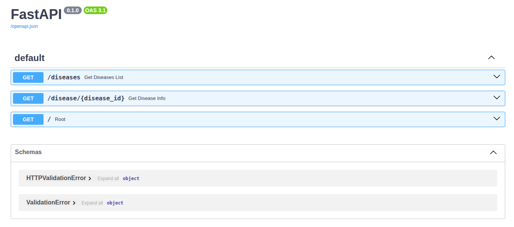
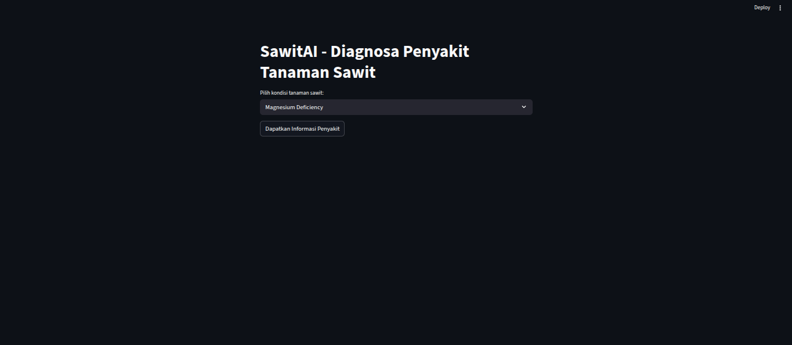
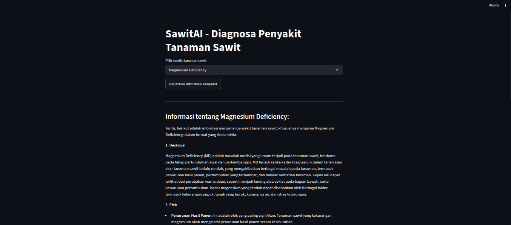

# Palm Tree Disease Conten Generator

Sistem LLM generate content untuk kesehatan tanaman kelapa sawit

## Prerequisites

Sebelum menjalankan proyek, pastikan perangkat Anda telah terpasang:
- **Python 3.9+**
- **Ollama Engine**: [Download di sini](https://ollama.ai/)
- **Model Gemma 3**: 
    
    run gemma 3:1B menggunakan Ollama di terminal / local.
    ```bash
    ollama run gemma3:1b
    ```

---

## How to Run

1. **Clone & Install Dependencies**

   ```bash
   git clone <repository_url>
   cd <this repo>
   ```

2. **Create Virtual Environment**
    ``` bash
    # Windows
    python -m venv venv
    venv\Scripts\activate

    # macOS/Linux
    python3 -m venv venv
    source venv/bin/activate
    ```

3. **Install Dependencies**
    ``` bash
    pip install -r requirements.txt
    ```

4. **Start Backend / API**
    ```
    uvicorn app:app --host 127.0.0.1 --port 8000 --reload
    ```

    Dokumentasi API (Swagger) : http://localhost:8000/docs

5. **Start Streamlit**
    ``` bash
    streamlit run uiStreamlit.py
    ```

    Akses Streamlit : http://localhost:8501

## C4 Diagram
**Akses Diagram C4 pada link berikut** : [Diagram C4](https://github.com/Dvaalmeyda/c4-deteksi-sawit)

## UI Screenshot

### API Documentation - Swagger

### Streamlit UI - Before Process

### Streamlit UI - Result
